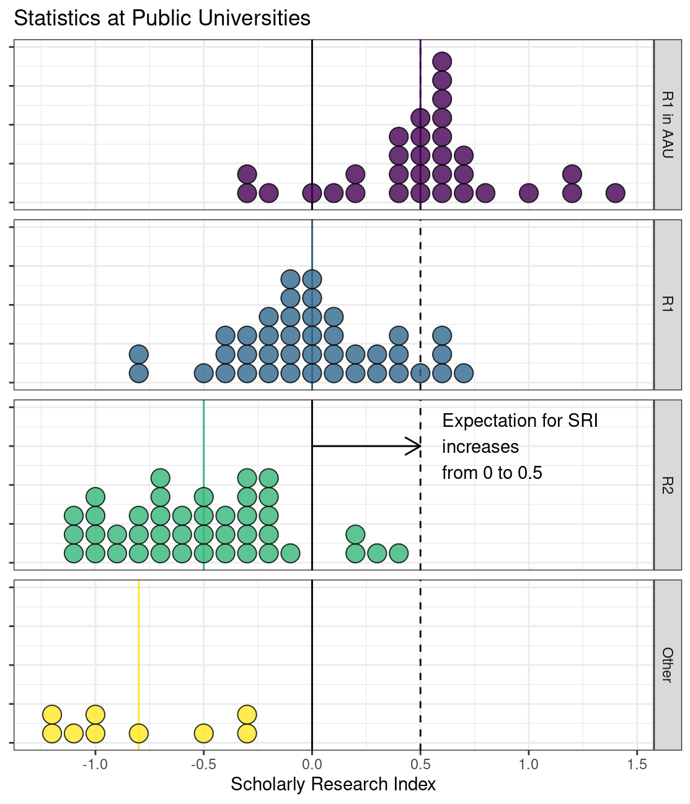
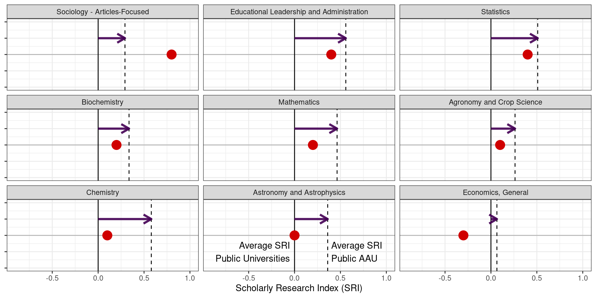

```{=css}
font-size: 10pt;
```


::: wideblock

Statistics does not always exist in its own department - groups are found within Mathematics, Computer Science, Data Science, Econometrics, and Business Analytics departments. However, within the Big Ten, there are fourteen Departments of Statistics and one School of Statistics (Minnesota). Two additional schools (USC, Maryland) have a group of statisticians within the math department. University of Oregon, the longtime exception, has recently created a [School of Computer and Data Science](https://scds.uoregon.edu/ds) and is actively hiring statisticians to support this initiative. 

Many AAU schools have both Statistics and Biostatistics groups on campus. Of 40 public AAU universities, only two do not have Statistics groups on campus (Univ. Utah, Univ. Oregon), and both of these have separate Data Science units. Only 9 of the 40 public AAU universities do not have Biostatistics departments in addition to their statistics groups. 

**By eliminating the Department of Statistics at UNL, we will be the exception within the Big Ten and the AAU.**

Many scientists, national academy members, and administrators from prestigious universities around the world wrote in during the APC process to provide letters of support. 

Common themes:

- Statistical expertise is critical for obtaining external competitive funding.
- Stat depts are lean, generating profits from service courses w/o equipment & lab overhead.
- Most universities are hiring statisticians and growing statistics programs to meet demand.
- UNL's BS degree is competitive & well designed. Eliminating the program before it graduates its first class is premature.
- Eliminating Statistics will do long-term damage to the university's reputation across disciplines. 
- Closing the department will be seen as a failure of institutional vision.

The Statistics department is not well represented by the metrics used to assess departments. 


**Teaching**

- New undergraduate major in 2022, first class (7 students) graduates Fall 2025/Spring 2026. 
- Undergraduates count as majors but cannot yet earn degrees, decreasing the Degrees/Majors ratio
- New program, new courses, small cohorts -- temporary decrease in SCH and SCH/FTE.  New courses are already seeing increased enrollment - Stat 251 is at capacity for Spring 2025.
- New courses taken by students in Statistics (est. 2022), Data Science (est. 2023), Digital Ag Minor (est. 2023) -- all new programs!

Cutting Statistics before these new programs have time to mature will prevent the inevitable return on these investments - a "buy high, sell low" strategy. 
These new programs represent an *investment* that is just *beginning to pay dividends*. 
:::


**Research**

- Higher turnover due to industry competition
- Research metric includes only 34% of possible faculty person-years.    
- ~25% of current faculty not included in  metrics.
- SRI for Statistics is 0.4 -- just below median SRI for public AAU statistics departments
- Department size is very small compared to peers -- but we offer programs at all levels (BS, MS, PhD) and have respectable research output.
- Statistics is critical for AAU goals and competitive grants **across disciplines**


The size of the public AAU SRI - public SRI shift (@fig-sri-shift) indicates the relative change in the discipline's rating in public AAU (dotted line) vs. public non-AAU (solid line) schools. Fundamental disciplines (Stat, Chem, Physics, Math) have large shifts, indicating their importance to the ecosystem of a public AAU university.

::: {.note arguments="dy:-4in, numbered:false"}

:::

::: {.note arguments="dy: -1.5in, numbered: false"}

:::


{#fig-sri-shift}


::: wideblock

**Conclusion**

Statistics is a **mission-critical** department for a land-grant R1 university with AAU aspirations. 
Eliminating the department will damage the reputation of the University of Nebraska on the national and international stage and limit competitiveness for national grants across the university. 
New programs are just beginning to grow and will be highly profitable based on experience at peer institutions.

See more information (presentations, APC report) at saveourstats.com

:::

<!-- # Using this template -->

<!-- This template will function primarily as a normal Quarto template and requires no special configuration to use the basic features. -->
<!-- However, to get full use of all Tufte-style features, you may find some additional features useful. -->
<!-- To support this, the [(christopherkenny/typst-function)](https://github.com/christopherkenny/typst-function) filter is embedded. -->
<!-- The next three subsections demonstrate how to use wideblocks, side notes, and place figures in the margin. -->
<!-- Quarto does not currently support margin *figures* so a slightly modified syntax is needed to use this feature.^[[At the time of writing this](https://github.com/quarto-dev/quarto-cli/blob/fe989e5468f2a5e0545a0db441a771a74f9e3098/src/resources/filters/customnodes/floatreftarget.lua#L1002-L1006), any "margin" positions in Typst were converted to "bottom", hence the need for this approach.] -->

<!-- You should keep the following in the document metadata: -->

<!-- ``` -->
<!-- functions: -->
<!--   - note -->
<!--   - wideblock -->
<!-- ``` -->

<!-- You are welcome to add to this, but removing these will limit your ability to use wideblocks (full width elements) and note (margin-only elements). -->

<!-- ## Wideblocks -->

<!-- ::: {.wideblock} -->

<!-- You may have noticed that this text spans the entire width of the page whereas the preceeding two pages were compressed to a four-inch-wide column in the typical manner of Tufte books. The template makes permissible the ability to break the narrow column format when desired by using a Typst-based `#wideblock()` function, which takes a single required argument representing the content to be displayed. The simplest way to use the wideblock is by using a div: -->

<!-- ```md -->
<!-- ::: {.wideblock} -->

<!-- your content -->

<!-- ::: -->
<!-- ``` -->

<!-- ::: -->

<!-- The wideblock simply is a Typst `block` but with the width parameter adjusted to make the block 6.5 inches wide. This can be useful when a full page does not contain any sidenotes and otherwise the text would look somewhat awkward being unnecessarily compressed into a narrow column. -->

<!-- ## Sidenotes -->

<!-- In Tufte books, sidenotes[This is a sidenote; perhaps you have already noticed them in this document.]{.note} are a distinctive feature: sidenotes are used for a variety of purposes, but mainly to provide non-critical but related information. In a basic sense, they are simply footnotes but put on the side. Sidenotes appear closer to the text being referenced. -->

<!-- This template implements sidenotes with a Typst `#note()` function. The simplest sidenote is created with `[enter your content here]{.note}` which yields:[enter your content here]{.note}. Notice how the sidenote is automatically numbered like a footnote. This can be disabled with the `numbered: false` argument.[This sidenote is not numbered.]{.note arguments="numbered: false"} -->

<!-- Sidenotes are most typically set with a span, `[text]{.note}` which is converted to Typst code for `#note()` with the `typst-function` filter. -->

<!-- On the backend, the `note()` function uses the `drafting` package @Jessurun2023, pre-configured with some defaults. Importantly, though, the `dy` argument can still be passed to `note()` in order to adjust the vertical offset as it appears. This is helpful when many notes are included in close vicinity. Though, `drafting` package will attempt to adjust vertical positions in such cases, sometimes a manual touch is necessary. -->

<!-- Strictly speaking, the `note()` function can be used with content of any kind, including figures. More will be discussed on the side figure topic, so it will be left for now. -->

<!-- There is one other type of sidenote: the citation-sidenote. Citations here follow the standard [Quarto syntax](https://quarto.org/docs/authoring/citations.html). -->
<!-- However, they are processed to be placed in the right margin. -->

<!-- ## Figures -->

<!-- Figures can be displayed in three different ways. -->
<!-- A standard figure, which sits within the body text can be placed as normal, without any special configuration. -->
<!-- This is demonstrated with @fig-plain-figure, below. -->
<!-- These figures only occupy the four-inch-wide space making up the width of the document. -->

<!-- ::: {#fig-plain-figure} -->

<!--  -->

<!-- This is just a plain figure. -->

<!-- ::: -->

<!-- Second, a `wideblock()` can be used to display a larger (or, at least wider) figure in the text, which spans 6.5 inches rather than four. This is demonstrated with @fig-wide. -->

<!-- ::: {.wideblock} -->

<!-- ::: {#fig-wide} -->

<!-- ```{=typst} -->
<!-- #rect(width:100%, height:3in) -->
<!-- ``` -->
<!-- The widest figure you've ever seen! -->

<!-- ::: -->

<!-- ::: -->

<!-- Note that this figure also demonstrates the ability to place raw Typst blocks within figures. You can mix and match as you see fit, but I strongly recommend using the basic figure formatting from Quarto, otherwise you may need to manually control figure kinds and their respective counters. In general, if you use Quarto syntax where possible and only resort to raw Typst at the last moment (like above using `#rect` only after setting up the figure), things should work. -->

<!-- Third, you can also display figures in the margin. -->
<!-- @fig-side-figure demonstrates this. -->
<!-- You can adjust their location using the `dy` argument to `note()`. You can use any [Typst length](https://typst.app/docs/reference/layout/length/), inlcuding inches ("in") or centimeters ("cm"). This note is moved 1.2 inches down on the page. -->

<!-- ::: {.note arguments="dy:-1.2in, numbered:false"} -->

<!-- ::: {#fig-side-figure} -->

<!--  -->

<!-- This is a little figure in the sidenotes. -->

<!-- ::: -->

<!-- ::: -->


<!-- ## Other Formatting -->
<!-- This template supports headings up to and including the third level. Levels below this are supported, but will use standard Quarto styling. -->

<!-- Text is displayed with a modest lightness (`luma(30)`) to reduce the harshness of the contrast between the type and the paper; links are displayed underline like  <www.example.com>. -->

<!-- To start a bibliography on a new page, it is recommended to use the [`{}` shortcode](https://quarto.org/docs/authoring/markdown-basics.html#page-breaks) which is included in Quarto automatically. -->

<!-- # Epilogue -->

<!-- #### [nogula](https://github.com/nogula)'s original thanks -->
<!-- Thank you to Edward Tufte for inspiring this template, and to other Typst contributes, particularly Nathan Jessurun for `drafting`. -->

<!-- #### [christopherkenny](https://github.com/christopherkenny)'s thanks -->

<!-- Thank you to nogula for building the Typst template from which this Quarto template is built. -->
